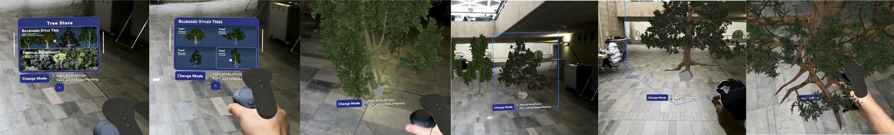
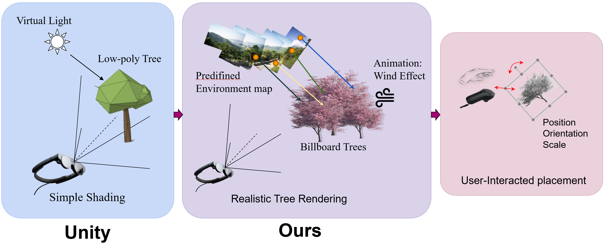

<p align="center">
  <h1 align="center">Rendering Trees in Mixed Reality</h1>
  <p align="center">
    <a href="https://github.com/feldspath"><strong>Marius Debussche*</strong></a>
    ·
    <a href="https://github.com/Sumato42"><strong>David Kamm*</strong></a>
    .
    <a href="https://github.com/Zykassoulet"><strong>Adrien Lanne*</strong></a>
    ·
    <a href="https://github.com/Ribosome-rbx"><strong>Boxiang Rong*</strong></a>
  </p>
  <p align="center"><strong>(* Equal Contribution)</strong></p>
  <h3 align="center"> <a href="./Resources/Rendering_Trees_in_Mixed_Reality.pdf">Paper</a> | <a href="https://docs.google.com/presentation/d/1MjJEeYk3IWrWuV2Ctf4495X7Q1sQIUH11DDMn2zhPJI/edit?usp=sharing">Poster</a> | <a href="https://youtu.be/BjEJ_WHgWJg">Video</a> </h3>
  <div align="center"></div>
</p>

[](https://youtu.be/BjEJ_WHgWJg)
<p align="center">
    (Click to View our Demo Video)
</p>
<p align="left">
    This is a project for <a href="https://github.com/MixedRealityETHZ">ETHZ Mixed Reality</a> course. We develop an MR program, where you can select different types of trees and plant them on the reconstructed ground. We achieve realistic rendering of trees by using: billboard-based models, RGB and normal mapping, environment map and leaf animation. Our user interface enables flexible and efficient tree planting. We also support "Hand Manipulation", to provide users with a better immersive experience.
</p>



## Getting Started
### Prerequisites
- [Unity 2023.3.13f1](https://unity.com/download)
- [Magic Leap Hub](https://ml2-developer.magicleap.com/downloads)

### Setup
Our project is developed on [Mixed Reality Toolkit for MagicLeap 2](https://developer-docs.magicleap.cloud/docs/guides/third-party/mrtk3/mrtk3-overview/). Please see their official [guidelines](https://developer-docs.magicleap.cloud/docs/guides/third-party/mrtk3/mrtk3-template/#getting-started) for trouble shooting. And we may also need to configure the project with [Magic Leap Setup Tool](https://assetstore.unity.com/packages/tools/integration/magic-leap-setup-tool-194780), see this [guideline](https://developer-docs.magicleap.cloud/docs/guides/unity/getting-started/configure-unity-settings/#quickstart) to prepare all the dependencies.  

### Run
With everything prepared, you can find our __Scene file(.unity)__ under this folder:
```
./UnityProjects/MRTKDevTemplate/Assets/Scenes/EmptyScene
``` 
Then, you may find the following links useful to run our project in Magic Leap Application Simulator and the device. 

Useful Links:
1. Magic Leap Application Simulator Setup[[link](https://developer-docs.magicleap.cloud/docs/guides/developer-tools/app-sim/app-sim-setup/)]
2. Compile unity file into Magic Leap device[[link](https://developer-docs.magicleap.cloud/docs/guides/unity/getting-started/unity-building-simple-app/)]
